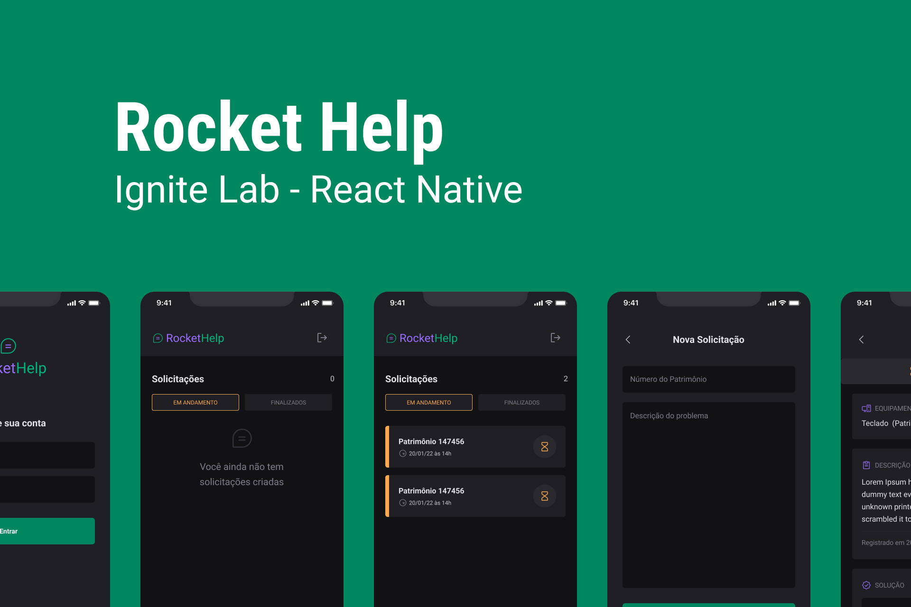
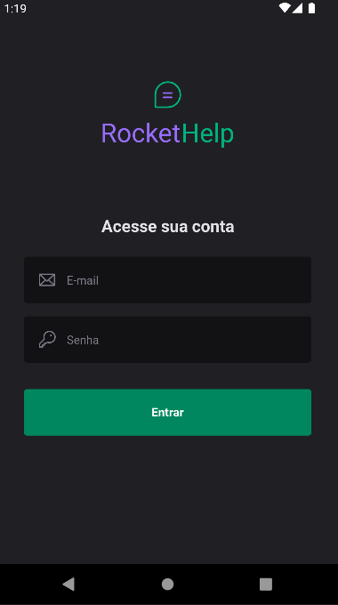
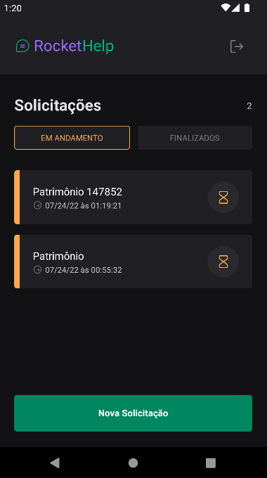
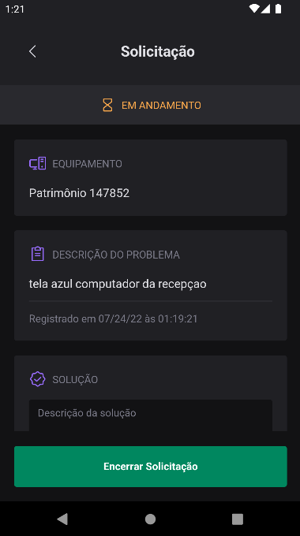
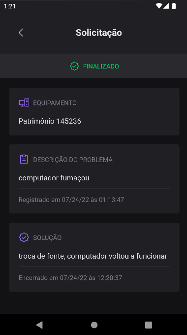
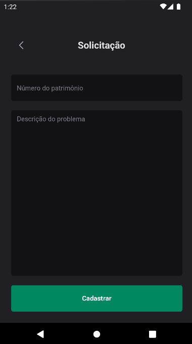

Aplicativo em React Native feito com os ensinamentos da [Rocketseat](https://rocketseat.com.br/) no evento ```Ignite Lab```.  
Neste app, você pode criar ticket's de solicitação, gerenciar seu status, descrição e solução.

## 🚀 Tecnologias Utilizadas:

- **[React Native](https://reactnative.dev/)**
- **[TypeScript](https://www.typescriptlang.org/)**
- **[Expo Bare Workflow](https://docs.expo.dev/bare/exploring-bare-workflow/)**


## 📚 Bibliotecas Utilizadas:

- **[Native Base](https://nativebase.io/)**
- **[React Native Firebase](https://rnfirebase.io/)**
- **[React Navigation](https://reactnavigation.org/)**
- **[Phosphor Icons](https://github.com/duongdev/phosphor-react-native)**
- **[React Native SVG Transformer](https://github.com/kristerkari/react-native-svg-transformer)**
- **[Expo Google Fonts](https://github.com/expo/google-fonts)**

## 🧮 Funcionalidades:

- **Autenticação de usuários**
- **Criar novas Solicitações**
- **Filtra solicitações pelo status**
- **Encerra solicitações com solução**
- **Sincronização com banco de dados em tempo real**
- **Entre outras...**

## 📷 Screenshots:

<div style="">
   
   
   
   
   
   
</div>

## 🧪 Experimente:

Você pode experimentar esse app em sua máquina, fazendo um clone do projeto:   
NOTA: É necessário ter todo o ambiente de desenvolvimento configurado antes.
```bash 
git clone https://github.com/wedgles97/rockethelp   
```
Depois execute as seguintes ações de linha de comando:
```bash
cd rockethelp
npm install
```
NOTA: Por motivos de segurança, foi retirado os arquivos de configuração do firebase *google-services.json* (android) e *GoogleService-Info.plist* (ios). Para testar, você deve baixar seus próprios arquivos de configuração em sua conta no [firebase](https://console.firebase.google.com/) registrando o aplicativo com o nome do pacote ```com.rockethelp``` (nenhuma outra configuração adicional é necessária).   
Deixe os arquivos baixados, na raiz do projeto.   
Em seguida execute estes comandos:
```bash
expo prebuild
expo run:android
```
OBS: Este processo pode levar um tempo.   

## FAQ 

### *De onde saiu o design do app?*

O design foi desenvolvido pela equipe da Rocketseat no evento Ignite Lab

### *Este projeto foi de evento?*

Originalmente sim, pela [Rocketseat](https://www.rocketseat.com.br/). O objetivo é aprender com mestres dessa tecnologia e fazer modificações pessoais.